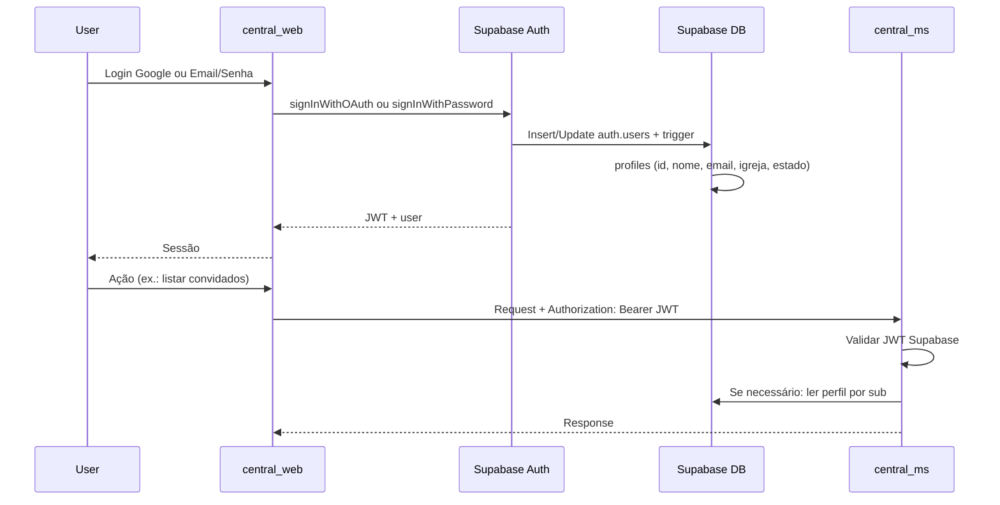

# Design de Autenticação - Central de Acolhimento

**Documento relacionado:** [System Design Document (SSD)](system-design-document.md)

Este documento descreve o contexto e a modelação de **Login** (Google, Email/Senha, Nome, Localidade) e o mapeamento com **.NET 9** e **Supabase**.

---

## 1. Contexto

Os usuários do sistema (coordenadores e irmãos da Rede de Cuidado) precisam:

- **Entrar** via **Google** (OAuth) ou **Email + Senha**.
- Ter identidade e **perfil** padronizado: **Nome**, **Email**, **Localidade** (Igreja e Estado), independente do provedor de login.

O backend (.NET 9) deve reconhecer usuários autenticados pelo Supabase (JWT) e, quando necessário, consultar perfil (nome, igreja, estado) no Supabase para autorização e personalização.

---

## 2. Mapeamento com Supabase

O **Supabase Auth** cobre o cenário completo:

| Necessidade | Supabase | Observação |
|-------------|----------|------------|
| Login com Google | [Auth – Google](https://supabase.com/docs/guides/auth/social-login/auth-google) | OAuth; email e nome vêm do Google. |
| Login com Email e Senha | Auth nativo (email + password) | Sign Up / Sign In padrão. |
| Nome | `raw_user_meta_data` e/ou tabela `profiles` | No Google vem em `user_metadata`; em email/senha enviado no sign-up. |
| Localidade (Igreja e Estado) | Tabela `public.profiles` | Campos `igreja`, `estado`; preenchidos no cadastro ou no primeiro login. |

Fluxo resumido:

1. **central_web (React):** Chama `supabase.auth.signInWithOAuth({ provider: 'google' })` ou `signInWithPassword({ email, password })`. No sign-up com email/senha, envia `options.data: { nome, igreja, estado }`.
2. **Supabase:** Cria/atualiza `auth.users`, preenche `raw_user_meta_data` (Google traz nome/email; email/senha traz o que for passado em `options.data`).
3. **Trigger no Supabase:** Ao inserir/atualizar em `auth.users`, sincroniza para `public.profiles` (id, nome, email, igreja, estado) para uso em queries e RLS.
4. **central_web** envia o **JWT** (session) em todas as chamadas ao **central_ms**.
5. **central_ms (.NET 9):** Valida o JWT do Supabase (secret do projeto), extrai `sub` (user id) e, se precisar de nome/igreja/estado, consulta a API do Supabase (ou tabela `profiles` via service role) usando esse id.

---

## 3. Modelagem de Dados (Auth e Perfil)

### 3.1 auth.users (Supabase – gerenciado pelo Auth)

- `id` (UUID) – identificador do usuário.
- `email` – preenchido pelo Google ou pelo sign-up com email/senha.
- `encrypted_password` – apenas para provedor email; null para Google.
- `raw_user_meta_data` (JSONB) – ex.: `full_name`, `nome`, `igreja`, `estado` (quando enviados no sign-up ou mapeados do Google).

Não é necessário alterar o schema interno do Auth; usa-se metadata e uma tabela de perfil.

### 3.2 public.profiles (tabela de perfil – app)

Perfil do usuário logado, alinhado ao que o .NET 9 e o Web precisam (Nome, Localidade: Igreja e Estado).

| Campo | Tipo | Descrição |
|-------|------|-----------|
| id | UUID, PK, FK → auth.users(id) | Mesmo id do usuário no Auth. |
| nome | text | Nome de exibição (do Google ou cadastro). |
| email | text | Email (espelho do auth para conveniência em queries). |
| igreja | text | Igreja/localidade (ex.: "Sapé"). |
| estado | text | Estado (ex.: "PB"). |
| avatar_url | text | Opcional; URL da foto (Google). |
| updated_at | timestamptz | Última atualização do perfil. |

Relacionamento com **Membros:** quando o usuário for um membro da Rede de Cuidado, pode existir um vínculo `membros.user_id` → `profiles.id` (ou `auth.users.id`), permitindo unir identidade (login) ao cadastro de membro (whatsapp, bairro, perfil_servico, etc.).

---

## 4. Fluxo Resumido (Mermaid)

---

## 5. .NET 9 – Papel no Login

O **central_ms** não implementa tela de login nem armazena senha; apenas:

1. **Validar JWT** emitido pelo Supabase (usando o JWT Secret do projeto no Dashboard do Supabase).
2. **Extrair** o `sub` (user id) do token para identificar o usuário.
3. **Opcional:** Chamar Supabase (REST ou client) com service role para ler `profiles` por `id = sub` quando precisar de nome, igreja ou estado nas regras de negócio ou em logs.

Bibliotecas úteis: **JWT Bearer** (validação do token) e **Supabase .NET client** ou **HttpClient** para acessar a API do Supabase (Admin/rest) quando necessário.

---

## 6. Resumo do Mapeamento

| Requisito | Onde fica | Como |
|-----------|-----------|------|
| Login com Google | Supabase Auth | Provider Google no Dashboard; central_web usa `signInWithOAuth('google')`. |
| Login com Email e Senha | Supabase Auth | `signUp` / `signInWithPassword`; nome/igreja/estado em `options.data`. |
| Nome | auth.users (metadata) + profiles | Trigger preenche `profiles.nome` a partir de `raw_user_meta_data`. |
| Localidade (Igreja e Estado) | profiles | Campos `igreja` e `estado`; coletados no cadastro ou na primeira entrada. |
| .NET 9 | central_ms | Valida JWT do Supabase; usa `sub` e, se necessário, consulta `profiles`. |

Sim, o modelo de **Login com Google, Email, Senha, Nome e Localidade (Igreja e Estado)** mapeia diretamente para **.NET 9 + Supabase**, com o Supabase como fonte única de identidade e perfil, e o .NET 9 consumindo o JWT e eventualmente a tabela `profiles`.
