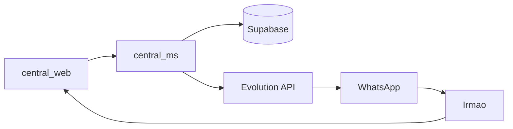

# System Design Document (SSD) - Central de Acolhimento

**Projeto:** Ecossistema Digital para Gestão de Acolhimento e Cuidado Espiritual

**Responsável:** Tiago (Senior Software Engineer)

**Versão:** 1.0 - 2026

**Status:** Iniciação / Definição de Arquitetura

---

## 1. Visão Geral

O sistema visa automatizar e organizar o fluxo de acolhimento da igreja em Sapé. Ele deve gerenciar o ciclo de vida de um convidado (desde o primeiro contato no TCI até a consolidação) e a escala da Rede de Cuidado (oração e energização), integrando-se via WhatsApp para garantir uma comunicação fluida e baseada na dependência de Deus.

---

## 2. Objetivos Estratégicos

- **Eficiência no Cuidado:** Evitar que novos contatos fiquem sem assistência.
- **Mobilização:** Facilitar para que irmãos identifiquem onde podem servir (abrindo a casa ou orando).
- **Monitoramento Metabólico:** Registrar o "consumo da Palavra" e o progresso espiritual de forma qualitativa.

---

## 3. Arquitetura de Software

### 3.1 Componentes do Sistema

| Componente | Tecnologia | Responsabilidade |
|------------|------------|------------------|
| **central_web** | React + Vite (PWA) | Interface para coordenadores e irmãos. Dashboards e formulários. |
| **central_ms** | .NET 9 (Web API) | Core Business Logic, orquestração de Webhooks e integração API. |
| **Database** | Supabase (PostgreSQL) | Persistência de dados, Auth e Realtime updates. |
| **Messaging** | Evolution API | Interface de comunicação automática via WhatsApp. |
| **Infrastructure** | VPS Própria | Hospedagem do Microserviço e Evolution API. |

### 3.2 Fluxo de Dados (High Level)

1. **Entrada:** Novo convidado é cadastrado via `central_web`.
2. **Processamento:** `central_ms` recebe o evento, consulta no Supabase o irmão disponível mais próximo e vincula o registro.
3. **Saída:** `central_ms` dispara um comando para a **Evolution API**, que envia os detalhes da visita ao irmão responsável via WhatsApp.
4. **Feedback:** O irmão responde ao WhatsApp ou preenche o "Check-in" no Web App, fechando o ciclo no Supabase.

### 3.3 Diagrama de Fluxo de Dados

---

## 4. Modelagem de Dados (Entidades Principais)

### Profiles (Perfil do usuário logado)

Tabela `public.profiles` sincronizada com Supabase Auth; armazena Nome, Email e Localidade (Igreja, Estado) para quem faz login (Google ou Email/Senha). Detalhes em [Design de Autenticação](auth-design.md).

| Campo | Tipo | Descrição |
|-------|------|-----------|
| id | UUID, PK, FK → auth.users(id) | Id do usuário no Auth. |
| nome | text | Nome de exibição. |
| email | text | Email. |
| igreja | text | Igreja/localidade (ex.: Sapé). |
| estado | text | Estado (ex.: PB). |
| avatar_url | text | Opcional; foto (Google). |
| updated_at | timestamptz | Última atualização. |

### Membros

| Campo | Tipo | Descrição |
|-------|------|-----------|
| id | UUID, PK | Identificador único |
| nome | string | Nome do membro |
| whatsapp | string | Número para contato |
| bairro | string | Bairro de residência |
| perfil_servico | ENUM | 'Casa Aberta', 'Rede Oração', 'Coordenador' |
| limite_acolhimento | int | Quantas pessoas pode cuidar simultaneamente |
| user_id | UUID, FK → profiles(id) | Opcional; vínculo com o usuário que faz login (profiles) |

### Contatos_TCI (Convidados)

| Campo | Tipo | Descrição |
|-------|------|-----------|
| id | UUID, PK | Identificador único |
| nome | string | Nome do convidado |
| whatsapp | string | Número para contato |
| status_vida | ENUM | 'Novo', 'Visitado', 'Frequenta Reunião', 'Consolidado' |
| responsavel_id | UUID, FK | Referência a Membros |

### Interacoes_Cuidado (Logs)

| Campo | Tipo | Descrição |
|-------|------|-----------|
| id | UUID, PK | Identificador único |
| contato_id | UUID, FK | Referência a Contatos_TCI |
| membro_id | UUID, FK | Referência a Membros |
| tipo | ENUM | 'Visita Presencial', 'Mensagem', 'Oração' |
| relato_metabolico | text | Registro qualitativo do cuidado |

---

## 5. Requisitos Não Funcionais

- **Escalabilidade:** O .NET 9 deve suportar o processamento assíncrono de Webhooks para não travar a aplicação em picos de mensagens.
- **Segurança:** Autenticação via Supabase Auth (JWT) para garantir que apenas irmãos autorizados vejam dados sensíveis (telefones/endereços). Login com **Google** (OAuth) e **Email/Senha**; perfil com Nome e Localidade (Igreja, Estado) — ver [Design de Autenticação](auth-design.md).
- **Disponibilidade:** A VPS deve rodar com Docker Compose para facilitar o restart automático dos serviços.

---

## 6. Roadmap de Implementação

- **Fase 1:** Setup do Supabase + .NET 9 Web API (CRUD básico de Membros/Convidados).
- **Fase 2:** Integração com Evolution API para notificações de "Boas-vindas" e "Escala".
- **Fase 3:** Web App em React com PWA para os irmãos realizarem o "Check-in" de cuidado.
- **Fase 4:** Dashboards de monitoramento para a coordenação em Sapé.

---

### Nota sobre manutenção do documento

Este SSD é o documento mestre do ecossistema Central de Acolhimento. Uma cópia idêntica é mantida em `central_acolhimento_ms/docs/architecture/` para que cada repositório seja autocontido. Alterações de arquitetura devem ser refletidas em ambos os lugares (ou, no futuro, o SSD pode ser centralizado em um repositório de documentação único).
